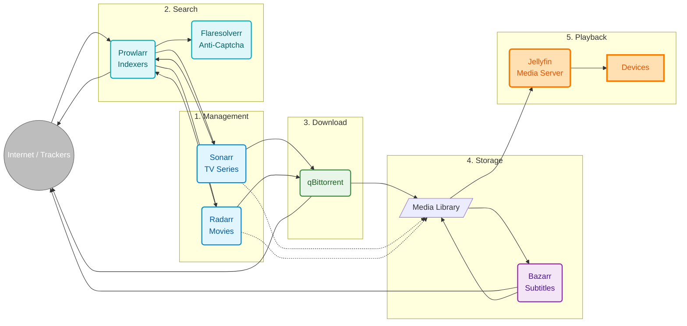

In my [previous post about my home server](/en/blog/my-networking-professor-was-right), I showed how I organized my home network with Proxmox, Pi-hole and other services. One of the centerpieces was **[Jellyfin](https://jellyfin.org/)** — an open-source media server to organize and play my personal collection.

But there was a problem: **manually managing** a media library is way too much work. Downloading files, converting formats, renaming, organizing into folders, finding subtitles... all manual.

I decided to go further and create a **fully automated personal media management system**. The result? A workflow that automatically organizes my video library and content.

---

## The Problem: Manual Management is Unsustainable

Before automation, my process for organizing my media library looked like this:

1. Search and download media files
2. Convert to compatible formats when necessary
3. Manually rename files to a consistent pattern
4. Move to the correct Jellyfin folder
5. Search for subtitles
6. Manually update the Jellyfin library

This worked for a small collection... but when you have dozens of files to organize regularly, the manual process becomes unsustainable.

**I needed automation.**

---

## The Solution: An Ecosystem of Integrated Tools

After a lot of research, I arrived at this architecture:



Looks complex? Let me explain each piece.

---

## The Tools and Their Functions

### 1. **Sonarr and Radarr** — The Managers

**[Sonarr](https://sonarr.tv/)** manages TV series. **[Radarr](https://radarr.video/)** manages movies.

They are the "brain" of the organization system. These tools were originally created to manage Usenet media collections, but work perfectly for organizing any video library:

- Monitor your library and identify disorganized files
- Automatically rename following consistent patterns
- Organize into logical folder structure
- Update metadata and artwork
- Integrate with Jellyfin to keep everything synchronized

**Practical example:** I have a folder with "Breaking Bad" episodes with inconsistent names. Sonarr:
- Automatically identifies each episode
- Renames to consistent pattern: `Breaking Bad - S01E01 - Pilot.mkv`
- Organizes into `/media/Series/Breaking Bad/Season 01/`
- Updates metadata in Jellyfin

All of this **automatically**.

---

### 2. **Prowlarr** — The Source Manager

**[Prowlarr](https://prowlarr.com/)** centralizes the management of metadata sources and indexers.

Instead of configuring each data source in Sonarr and Radarr separately, you configure everything in Prowlarr once, and it automatically syncs with all services.

**Why does this matter?**
- Adding a new metadata source? Configure in Prowlarr and all services receive it
- Removing a problematic source? One click
- Testing which source has better results? Centralized dashboard

This is especially useful when you use multiple legitimate sources like public databases of movie and series metadata.

---

### 3. **Flaresolverr** — The Protection Resolver

**[Flaresolverr](https://github.com/FlareSolverr/FlareSolverr)** is a proxy that handles anti-bot protections (Cloudflare, captchas) that some metadata sites use.

Without it, many queries to public databases would fail. With it, everything works transparently, allowing services to search for information about movies and series automatically.

---

### 4. **qBittorrent** — The Transfer Manager

**[qBittorrent](https://www.qbittorrent.org/)** is an open-source BitTorrent client I use to transfer large files efficiently.

It's perfect for distributing personal content (like personal project videos) or downloading Linux distributions and public domain content. It runs in headless mode (no graphical interface) and is controlled via API.

**Important settings:**
- Automatic transfer management
- Move completed files to processing folder
- Speed limits to avoid network congestion
- Configurable upload/download control

---

### 5. **Bazarr** — The Subtitle Manager

**[Bazarr](https://www.bazarr.media/)** monitors the media library and automatically searches for subtitles in public repositories like OpenSubtitles, Subdivx, and others.

**How it works:**
1. A new video file is added to the library
2. Bazarr detects the new file
3. Searches for subtitles in your preferred language in public databases
4. Downloads and saves next to the video file
5. Jellyfin detects and makes the subtitle available

This is especially useful for home videos, educational documentaries, or content that doesn't come with subtitles in your language.

---

### 6. **Jellyfin** — The Media Server

**[Jellyfin](https://jellyfin.org/)** is the open-source media server that organizes and plays all content. It:

- Scans the media library
- Fetches metadata (synopsis, posters, cast) from public databases like TMDB/TVDB
- Transcodes videos in real-time (if needed)
- Provides apps for TV, mobile, browser

It's a complete solution for organizing your personal video collection, with **total control** over your data and privacy.

---

## The Complete Flow in Action

Let's see a real example of how everything works together:

**Scenario:** I downloaded a complete series and want to organize it automatically

1. **I add the series to Sonarr** → Set naming pattern and organization
2. **I put the files in the import folder** → Files with inconsistent names
3. **Sonarr detects the files** → Automatically identifies each episode
4. **Sonarr organizes and renames** → Moves to `/media/Series/Series Name/Season 01/` with standardized name
5. **Bazarr detects new files** → Searches for subtitles in public repositories
6. **Bazarr downloads subtitles** → Saves as `.srt` next to video files
7. **Jellyfin scans** → Detects new episodes, fetches metadata from TMDB, makes available

**All of this happens automatically.** I just put the files in the import folder and the system takes care of the rest.

---

## Infrastructure: Proxmox + Docker Compose

As I mentioned in my [previous post](/en/blog/my-networking-professor-was-right), everything runs on my home server with **Proxmox VE**. I created a dedicated LXC container for this media stack, which ensures isolation and makes management easier.

Inside this container, all services run via **Docker Compose**, which ensures:

- **Isolation** — Each service runs independently
- **Portability** — I can move everything to another server/container easily
- **Simple updates** — `docker-compose pull && docker-compose up -d`
- **Easy backup** — Volumes mapped for easy backup
- **Controlled resources** — Proxmox allows limiting CPU/RAM of the container

**Folder structure:**

```
/media/
├── Series/          # Organized series
├── Movies/          # Organized movies
└── Downloads/       # Temporary download folder

/docker/
├── sonarr/
├── radarr/
├── prowlarr/
├── bazarr/
├── qbittorrent/
├── flaresolverr/
└── jellyfin/
```

---

## Network Configuration

Each service has a fixed IP on my network (remember the [post about network organization](/en/blog/my-networking-professor-was-right)?):

| Service | IP | Port |
|---------|-----|-------|
| Jellyfin | 192.168.1.13 | 8096 |
| Bazarr | 192.168.1.16 | 6767 |
| qBittorrent | 192.168.1.17 | 8080 |
| Sonarr | 192.168.1.18 | 8989 |
| Prowlarr | 192.168.1.19 | 9696 |
| Flaresolverr | 192.168.1.8 | 8191 |
| Radarr | 192.168.1.9 | 7878 |

This makes debugging, firewall rules, and VPN access easier.

---

## Real Benefits

After months using this system:

### ✅ **Total Automation**
- Files organized automatically
- Subtitles added automatically
- Library always organized and consistent

### ✅ **Consistent Quality**
- Standardized naming
- Logical folder structure
- Complete metadata (synopsis, posters, cast)

### ✅ **Total Control**
- Your data stays with you
- No dependence on third-party services
- Complete offline access
- Privacy guaranteed

### ✅ **Savings**
- 100% open-source and free software
- Used/cheap hardware works perfectly
- No recurring costs

---

## Important Considerations

### **Legality and Responsible Use**

This system is a **personal media library management and organization** tool. All mentioned tools are legitimate open-source software, used by thousands of people to organize legal content.

**Legitimate use cases include:**

- **Personal content**: Organize home videos, family recordings, personal projects
- **Public domain content**: Classic films, educational documentaries, copyright-free content
- **Licensed productions**: Content you created or have a license to use
- **Linux distributions**: Organize ISOs and open-source content
- **Personal media**: Organize any digital content you legally own

**It is your responsibility to ensure you have legal rights to all content you manage.** Respect your country's copyright laws.

These tools are neutral — like an external hard drive or a flash drive. What matters is how you use them.

### **Security**

- **Never expose these services directly to the internet**
- Use VPN for remote access (OpenVPN, WireGuard)
- Configure strong authentication on all services
- Keep everything updated

### **Performance**

- SSD for operating system and containers
- HDD for media storage (cheaper per TB)
- Minimum 8GB RAM (16GB recommended)
- CPU with video transcoding support (Intel QuickSync or dedicated GPU)

---

## What I Learned

1. **Good automation is invisible** — When it works, you forget it exists
2. **Open-source is powerful** — All these tools are free and maintained by amazing communities
3. **Documentation saves lives** — Keeping a diagram and notes about configurations is essential
4. **Backup is mandatory** — Losing months of configuration due to lack of backup is painful
5. **Community is fundamental** — Forums, Reddit, Discord... there's always someone who's been through the same problem

---

## Conclusion

Building an automated personal media management system may seem complex at first, but the result is **liberating**.

You have total control over your data and privacy, professional organization of your personal collection, and access to all your content from anywhere (via VPN).

And the best part: once configured, **it runs itself**. Just add new files and the system takes care of organizing, renaming, adding metadata and subtitles automatically.

---

*Do you have a media server or automation project? Want to exchange ideas about homelab? Hit me up!*
