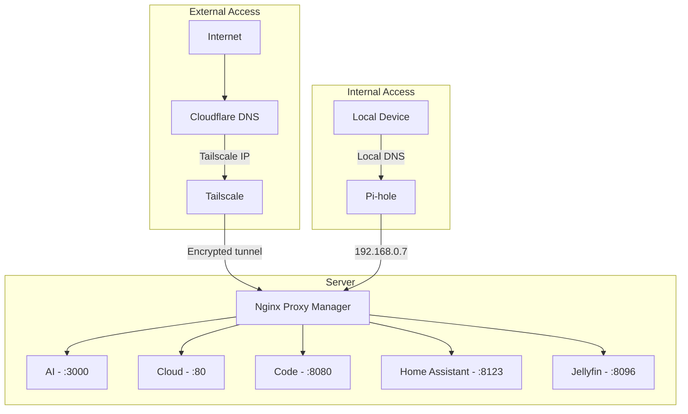

If you've been following the blog, you know this story started a while back. In my post about [how my Networking professor was right](/en/blog/my-networking-professor-was-right), I shared how I organized my home network with Proxmox, Pi-hole, and VPN. Then, in the article about [automating my personal media library](/en/blog/automating-personal-media-library), I showed the ecosystem of services running on the server.

But there was one thing that kept bothering me: remote access. I was using OpenVPN, and it worked, but it was cumbersome — configuring clients, dealing with certificates, and always that feeling that it could be simpler. On top of that, I still had open ports on the router, which never sat right with me.

What if I told you that you can have **secure remote access to all your services, with a custom domain, valid SSL, and zero open ports on the internet**?

In this article, I'll show you the latest evolution of my homelab — the architecture that finally made me satisfied.

> **TL;DR:** I use [Cloudflare](https://www.cloudflare.com/) as public DNS pointing to the [Tailscale](https://tailscale.com/) IP (zero open ports), [Nginx Proxy Manager](https://nginxproxymanager.com/) as reverse proxy with SSL, and [Pi-hole](https://pi-hole.net/) with split DNS for direct local access. Away from home, traffic goes through Tailscale's encrypted tunnel. At home, Pi-hole resolves directly to the local Nginx.

## What we're building

Before diving into the details, here's a summary of what this architecture delivers:

- **Internal access (at home):** your devices resolve the domain directly to the local server, without going through the internet — fast and direct.
- **External access (away from home):** traffic flows through an encrypted tunnel via Tailscale, with no ports exposed on your router.
- **Custom domain with SSL:** all services accessible through clean subdomains like `cloud.yourdomain.com`, with valid HTTPS certificates.
- **Smart DNS:** Pi-hole resolves locally when you're home, and Cloudflare handles the rest when you're away.

## Understanding the puzzle pieces

Think of the setup as a building with a smart front desk:

| Component | Role | Analogy |
|---|---|---|
| **[Cloudflare](https://www.cloudflare.com/)** | Public DNS | The street sign that says "the building is here" |
| **[Tailscale](https://tailscale.com/)** | Private mesh VPN | The secret tunnel only residents know about |
| **[Nginx Proxy Manager](https://nginxproxymanager.com/)** | Reverse proxy | The doorman who knows which apartment each visitor needs |
| **[Pi-hole](https://pi-hole.net/)** | Local DNS + split DNS | The internal intercom — if you're already in the building, you don't need to go outside to get in |

Each piece has a clear responsibility. Together, they form an architecture that is secure by design, not by luck.

## The complete architecture

Here's the visual flow of how everything connects:



Notice there are **two paths** to reach the services, but both converge at the Nginx Proxy Manager. That's the beauty of this setup: a single entry point, two access routes.

## Step-by-step setup

### 1. Configuring Tailscale

[Tailscale](https://tailscale.com/) is the security backbone of this setup. It creates a private network (called a **tailnet**) between your devices using the [WireGuard](https://www.wireguard.com/) protocol under the hood — no need to open ports.

**Installation on the server:**

```bash
curl -fsSL https://tailscale.com/install.sh | sh
sudo tailscale up --advertise-routes=192.168.0.0/24
```

The `--advertise-routes` parameter is crucial: it tells Tailscale that your server can route traffic to the `192.168.0.0/24` network. This means that from outside, you can access any device on your local network through Tailscale.

**Important settings in the Tailscale admin panel:**

- **MagicDNS:** enable to automatically resolve tailnet names.
- **HTTPS Certificates:** enable to get valid SSL certificates for tailnet devices.
- **Subnet routes:** approve the `192.168.0.0/24` route in the admin panel.

After configuration, your server gets an IP in the `100.x.y.z` range — this is the IP we'll use in Cloudflare.

### 2. Configuring Cloudflare

In Cloudflare, the setup is straightforward. For each service, create a DNS record of type **A**:

| Subdomain | Type | Value | Proxy |
|---|---|---|---|
| `ai.yourdomain.com` | A | `100.x.y.z` | DNS only |
| `cloud.yourdomain.com` | A | `100.x.y.z` | DNS only |
| `code.yourdomain.com` | A | `100.x.y.z` | DNS only |
| `ha.yourdomain.com` | A | `100.x.y.z` | DNS only |
| `jellyfin.yourdomain.com` | A | `100.x.y.z` | DNS only |

**Why "DNS only" and not "Proxied"?**

Because the traffic already goes through Tailscale, which is end-to-end encrypted. If we enabled Cloudflare's proxy, it would try to connect to the Tailscale IP — and fail, because that IP is only accessible from within the tailnet.

Cloudflare here works purely as an authoritative DNS: "this domain points to this IP". Tailscale handles the actual connection.

### 3. Configuring Nginx Proxy Manager

[Nginx Proxy Manager](https://nginxproxymanager.com/) (NPM) is the user-friendly interface that routes subdomains to the correct services.

**Installation via Docker Compose:**

```yaml
services:
  nginx-proxy-manager:
    image: jc21/nginx-proxy-manager:latest
    container_name: nginx-proxy-manager
    restart: unless-stopped
    ports:
      - "80:80"
      - "443:443"
      - "81:81"  # Admin panel
    volumes:
      - ./data:/data
      - ./letsencrypt:/etc/letsencrypt
```

**Configuring a Proxy Host:**

For each service, create a **Proxy Host** in the NPM panel:

1. **Domain Names:** `ai.yourdomain.com`
2. **Scheme:** `http`
3. **Forward Hostname/IP:** `192.168.0.24`
4. **Forward Port:** `3000`
5. **SSL:** Request a new SSL certificate ([Let's Encrypt](https://letsencrypt.org/))
6. **Force SSL:** enabled

Repeat for each service:

| Subdomain | Target |
|---|---|
| `ai` | `192.168.0.24:3000` |
| `cloud` | `192.168.0.11:80` |
| `code` | `192.168.0.24:8080` |
| `ha` | `192.168.0.12:8123` |
| `jellyfin` | `192.168.0.13:8096` |

NPM automatically handles SSL certificate renewal. You set it up once and forget about it.

### 4. Configuring Pi-hole (Split DNS)

Here's the final touch — and perhaps the most elegant part of the setup.

[Pi-hole](https://pi-hole.net/) is already well-known as a DNS-based ad blocker. But it has a powerful feature that few people explore: **Local DNS**.

**The problem without split DNS:**

When you're at home and access `cloud.yourdomain.com`, without split DNS the flow would be:

```
Your PC → Internet → Cloudflare → Tailscale IP → back to your network
```

This is inefficient — traffic leaves your network and comes back. Worse: it might not even work if Tailscale isn't running on the local device.

**The solution with split DNS:**

Add a Pi-hole entry that resolves the entire domain to the local Nginx IP:

```
address=/yourdomain.com/192.168.0.7
```

This magic line says: "anything ending with `yourdomain.com`, resolve to `192.168.0.7`". This includes all subdomains automatically.

**How to configure:**

1. Access the Pi-hole panel
2. Go to **Local DNS → DNS Records**
3. Or edit the configuration file directly:

```bash
sudo nano /etc/dnsmasq.d/02-custom.conf
```

Add:

```
address=/yourdomain.com/192.168.0.7
```

4. Restart Pi-hole:

```bash
sudo pihole restartdns
```

Now, when you're at home, the flow is:

```
Your PC → Pi-hole → 192.168.0.7 (Nginx) → Local service
```

Direct, fast, never leaving the network.

## Internal vs external flow: how everything connects

Let's visualize both scenarios side by side:

### When you're at home


1. Your PC asks Pi-hole: "where is `cloud.yourdomain.com`?"
2. Pi-hole responds: `192.168.0.7` (local Nginx)
3. Nginx receives the request and forwards it to `192.168.0.11:80`
4. Nextcloud responds

**Latency:** practically zero. Everything happens on the local network.

### When you're away from home


1. Your phone (with Tailscale active) resolves `cloud.yourdomain.com` via Cloudflare
2. Cloudflare returns the server's Tailscale IP
3. Tailscale creates an encrypted tunnel to the server
4. Nginx receives and forwards to Nextcloud
5. Everything encrypted, zero open ports

**Security:** even if someone discovers the Tailscale IP, they can't connect — they'd need to be authenticated in your tailnet.

## Common issues and how to fix them

### "I can't access services from outside"

**Checklist:**

- Is Tailscale running on your mobile device/laptop?
- Were the subnet routes (`192.168.0.0/24`) approved in the Tailscale admin panel? This is easy to forget — approving in the admin is a separate step from `--advertise-routes`.
- Does the Cloudflare DNS point to the correct Tailscale IP? Verify with `tailscale ip -4` on the server.
- Is Nginx Proxy Manager running and listening on port 443?
- Try accessing directly via the Tailscale IP (`https://100.x.y.z`) to isolate whether the issue is DNS or connectivity.

### "It works outside but not inside the house"

This is the most common problem for people who set everything up and forget about split DNS. What happens: at home, your device resolves the domain via Cloudflare, gets the Tailscale IP (`100.x.y.z`), but can't connect because Tailscale isn't running on that local device. This is called **hairpin NAT** — traffic leaves the network and tries to come back.

**Checklist:**

- Are your devices using Pi-hole as their DNS server? Check in **Settings → DNS** on your router or directly on the device. If DHCP delivers a different DNS, split DNS won't work.
- Is the `address=/yourdomain.com/192.168.0.7` entry in dnsmasq?
- Was Pi-hole restarted after the change? (`pihole restartdns`)
- Test with `nslookup cloud.yourdomain.com` — the result should be `192.168.0.7`, not `100.x.y.z`.

### "SSL doesn't work / invalid certificate"

- [Let's Encrypt](https://letsencrypt.org/) certificates require domain validation. If you use **HTTP challenge**, Nginx needs to be accessible from the internet on port 80 — which conflicts with our zero open ports setup.
- **Recommended solution:** use **DNS challenge** with the Cloudflare API. In NPM, go to SSL Certificates → Add → select "Use a DNS Challenge" and configure the Cloudflare API credentials. This way validation happens via DNS, no open ports needed.
- If the certificate works outside but not inside, the issue is likely split DNS — the browser is trying to validate the certificate against the local IP.

### "Tailscale disconnects after a while"

- On the server, use `sudo tailscale up --operator=$USER` to prevent the session from expiring.
- On mobile devices, make sure the app has permission to run in the background.
- On Android, disable "battery optimization" for the Tailscale app.
- On iOS, enable "Background App Refresh" in Tailscale settings.

### "DNS takes too long to update"

- Flush local DNS cache: `sudo resolvectl flush-caches` (Linux) or `ipconfig /flushdns` (Windows).
- In Pi-hole, go to **Settings → DNS** and reduce the TTL if needed.
- Browsers also cache DNS internally — try in an incognito tab or restart the browser.

## Why this architecture is superior

Compared to traditional approaches:

| Aspect | Traditional Port Forwarding | This Setup |
|---|---|---|
| **Open ports** | Yes (80, 443, etc.) | None |
| **Public IP exposed** | Yes | No |
| **Needs DDNS** | Yes | No |
| **Encryption** | Depends on config | Always (WireGuard) |
| **Internal access** | May have hairpin NAT | Direct via split DNS |
| **Complexity** | Medium (but fragile) | Medium (but robust) |
| **Scalability** | Limited | Excellent |

Other benefits:

- **Zero-trust security:** each device needs to be authenticated in the tailnet.
- **No single point of failure on the internet:** if Cloudflare goes down, internal access continues working normally.
- **Easy to scale:** new service? Add a proxy host in Nginx and a record in Cloudflare. Done.
- **Privacy:** Pi-hole still blocks ads and trackers for the entire network.

## The setup's evolution

If you've been following the blog, you've seen this journey unfold in real time:

1. **[My Networking professor was right](/en/blog/my-networking-professor-was-right):** where it all started — I organized the network, segmented by function, set up Pi-hole and Proxmox. Remote access was via OpenVPN.
2. **[Automating my media library](/en/blog/automating-personal-media-library):** the homelab took shape with Jellyfin, Sonarr, Radarr and the whole self-hosted services ecosystem.
3. **Discovering Tailscale:** the game changer. Remote access without opening ports changed everything. I retired OpenVPN the same day.
4. **Nginx Proxy Manager:** organized subdomains with SSL, finally a presentable setup.
5. **Split DNS with Pi-hole:** the final touch to eliminate unnecessary latency on local access.

Each step was a learning experience. The setup I'm showing here wasn't born ready — it's the result of many iterations. And it will probably keep evolving.

## Conclusion

Building a secure homelab doesn't have to be complicated or expensive. With four tools — Cloudflare, Tailscale, Nginx Proxy Manager, and Pi-hole — you can:

- Access your services from anywhere in the world
- Without opening a single port on your router
- With end-to-end encryption
- With a custom domain and valid SSL
- With fast and smart local access

Most importantly: you have **full control** over your data and infrastructure. No third-party service has access to the content of your services — Tailscale and Cloudflare only route the traffic.

If you're starting your homelab or want to improve remote access, this is an excellent starting point. And if you already have something running, adapting to this architecture is simpler than it seems.

---

## A personal note

I need to be honest: networking and infrastructure **is not my main area**. I'm a software developer — my day-to-day is code, not packet routing. Everything I've shown here is the result of curiosity, late-night research, and a lot of trial and error.

I started getting into networking relatively recently, and every problem I solve pulls me deeper into this rabbit hole. But precisely because it's not my specialty, I know there's always room for improvement.

If you work in networking, infrastructure, or security and spotted something that could be done better — **contributions are very welcome**. Reach out or send a suggestion. This blog is a learning space, and I learn as much from writing as I do from your feedback.
