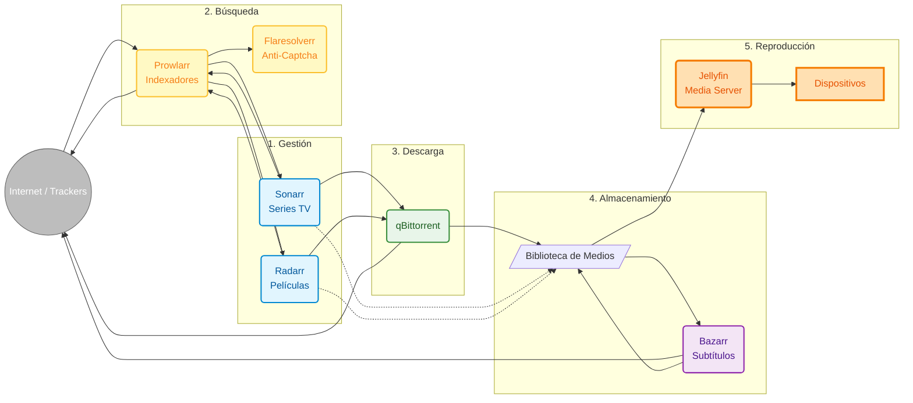

En mi [post anterior sobre mi servidor casero](/es/blog/my-networking-professor-was-right), mostré cómo organicé mi red doméstica con Proxmox, Pi-hole y otros servicios. Una de las piezas centrales era **[Jellyfin](https://jellyfin.org/)** — un servidor de medios open-source para organizar y reproducir mi colección personal.

Pero había un problema: **gestionar manualmente** una biblioteca de medios es demasiado trabajo. Descargar archivos, convertir formatos, renombrar, organizar en carpetas, buscar subtítulos... todo manual.

Decidí ir más allá y crear un **sistema completamente automatizado** de gestión de medios personales. ¿El resultado? Un flujo que organiza automáticamente mi biblioteca de videos y contenido.

---

## El Problema: La Gestión Manual es Insostenible

Antes de la automatización, mi proceso para organizar mi biblioteca de medios era así:

1. Buscar y descargar archivos de medios
2. Convertir a formatos compatibles cuando sea necesario
3. Renombrar archivos manualmente a un patrón consistente
4. Mover a la carpeta correcta de Jellyfin
5. Buscar subtítulos en español
6. Actualizar la biblioteca de Jellyfin manualmente

Esto funcionaba para una colección pequeña... pero cuando tienes decenas de archivos para organizar regularmente, el proceso manual se vuelve insostenible.

**Necesitaba automatización.**

---

## La Solución: Un Ecosistema de Herramientas Integradas

Después de mucha investigación, llegué a esta arquitectura:



¿Parece complejo? Voy a explicar cada pieza.

---

## Las Herramientas y Sus Funciones

### 1. **Sonarr y Radarr** — Los Gestores

**[Sonarr](https://sonarr.tv/)** gestiona series de TV. **[Radarr](https://radarr.video/)** gestiona películas.

Son el "cerebro" del sistema de organización. Estas herramientas fueron creadas originalmente para gestionar colecciones de medios Usenet, pero funcionan perfectamente para organizar cualquier biblioteca de videos:

- Monitorean tu biblioteca e identifican archivos desorganizados
- Renombran automáticamente siguiendo patrones consistentes
- Organizan en estructura de carpetas lógica
- Actualizan metadatos y artwork
- Se integran con Jellyfin para mantener todo sincronizado

**Ejemplo práctico:** Tengo una carpeta con episodios de la serie "Breaking Bad" con nombres inconsistentes. Sonarr:
- Identifica automáticamente cada episodio
- Renombra a patrón consistente: `Breaking Bad - S01E01 - Pilot.mkv`
- Organiza en `/media/Series/Breaking Bad/Season 01/`
- Actualiza metadatos en Jellyfin

Todo esto **automáticamente**.

---

### 2. **Prowlarr** — El Gestor de Fuentes

**[Prowlarr](https://prowlarr.com/)** centraliza la gestión de fuentes de metadatos e indexadores.

En lugar de configurar cada fuente de datos en Sonarr y Radarr por separado, configuras todo en Prowlarr una vez, y se sincroniza automáticamente con todos los servicios.

**¿Por qué importa esto?**
- ¿Agregar una nueva fuente de metadatos? Configura en Prowlarr y todos los servicios la reciben
- ¿Eliminar una fuente problemática? Un clic
- ¿Probar qué fuente tiene mejores resultados? Dashboard centralizado

Esto es especialmente útil cuando usas múltiples fuentes legítimas como bases de datos públicas de metadatos de películas y series.

---

### 3. **Flaresolverr** — El Resolvedor de Protecciones

**[Flaresolverr](https://github.com/FlareSolverr/FlareSolverr)** es un proxy que maneja protecciones anti-bot (Cloudflare, captchas) que algunos sitios de metadatos usan.

Sin él, muchas consultas a bases de datos públicas fallarían. Con él, todo funciona transparentemente, permitiendo que los servicios busquen información sobre películas y series automáticamente.

---

### 4. **qBittorrent** — El Gestor de Transferencias

**[qBittorrent](https://www.qbittorrent.org/)** es un cliente BitTorrent open-source que uso para transferir archivos grandes de forma eficiente.

Es perfecto para distribuir contenido propio (como videos de proyectos personales) o descargar distribuciones Linux y contenido de dominio público. Funciona en modo headless (sin interfaz gráfica) y es controlado vía API.

**Configuraciones importantes:**
- Gestión automática de transferencias
- Mover archivos completados a carpeta de procesamiento
- Límites de velocidad para no congestionar la red
- Control de subida/descarga configurable

---

### 5. **Bazarr** — El Gestor de Subtítulos

**[Bazarr](https://www.bazarr.media/)** monitorea la biblioteca de medios y busca subtítulos automáticamente en repositorios públicos como OpenSubtitles, Subdivx, y otros.

**Cómo funciona:**
1. Se agrega un nuevo archivo de video a la biblioteca
2. Bazarr detecta el nuevo archivo
3. Busca subtítulos en español en bases públicas
4. Descarga y guarda junto al archivo de video
5. Jellyfin detecta y hace disponible el subtítulo

Esto es especialmente útil para videos caseros, documentales educativos, o contenido que no viene con subtítulos en español.

---

### 6. **Jellyfin** — El Media Server

**[Jellyfin](https://jellyfin.org/)** es el servidor de medios open-source que organiza y reproduce todo el contenido. Él:

- Escanea la biblioteca de medios
- Busca metadatos (sinopsis, pósters, elenco) en bases públicas como TMDB/TVDB
- Transcodifica videos en tiempo real (si es necesario)
- Proporciona apps para TV, móvil, navegador

Es una solución completa para organizar tu colección personal de videos, con **control total** sobre tus datos y privacidad.

---

## El Flujo Completo en Acción

Veamos un ejemplo real de cómo todo funciona junto:

**Escenario:** Descargué una serie completa y quiero organizarla automáticamente

1. **Agrego la serie en Sonarr** → Defino patrón de nomenclatura y organización
2. **Coloco los archivos en la carpeta de importación** → Archivos con nombres inconsistentes
3. **Sonarr detecta los archivos** → Identifica automáticamente cada episodio
4. **Sonarr organiza y renombra** → Mueve a `/media/Series/Nombre de la Serie/Season 01/` con nombre estandarizado
5. **Bazarr detecta nuevos archivos** → Busca subtítulos en español en repositorios públicos
6. **Bazarr descarga subtítulos** → Guarda como `.srt` junto a los archivos de video
7. **Jellyfin escanea** → Detecta nuevos episodios, busca metadatos en TMDB, hace disponible

**Todo esto sucede automáticamente.** Solo coloco los archivos en la carpeta de importación y el sistema se encarga del resto.

---

## Infraestructura: Proxmox + Docker Compose

Como mencioné en el [post anterior](/es/blog/my-networking-professor-was-right), todo funciona en mi servidor casero con **Proxmox VE**. Creé un contenedor LXC dedicado para este stack de medios, lo que garantiza aislamiento y facilita la gestión.

Dentro de este contenedor, todos los servicios funcionan vía **Docker Compose**, lo que garantiza:

- **Aislamiento** — Cada servicio funciona independientemente
- **Portabilidad** — Puedo mover todo a otro servidor/contenedor fácilmente
- **Actualizaciones simples** — `docker-compose pull && docker-compose up -d`
- **Backup facilitado** — Volúmenes mapeados para fácil backup
- **Recursos controlados** — Proxmox permite limitar CPU/RAM del contenedor

**Estructura de carpetas:**

```
/media/
├── Series/          # Series organizadas
├── Movies/          # Películas organizadas
└── Downloads/       # Carpeta temporal de descargas

/docker/
├── sonarr/
├── radarr/
├── prowlarr/
├── bazarr/
├── qbittorrent/
├── flaresolverr/
└── jellyfin/
```

---

## Configuraciones de Red

Cada servicio tiene una IP fija en mi red (¿recuerdas el [post sobre organización de red](/es/blog/my-networking-professor-was-right)?):

| Servicio | IP | Puerto |
|---------|-----|-------|
| Jellyfin | 192.168.1.13 | 8096 |
| Bazarr | 192.168.1.16 | 6767 |
| qBittorrent | 192.168.1.17 | 8080 |
| Sonarr | 192.168.1.18 | 8989 |
| Prowlarr | 192.168.1.19 | 9696 |
| Flaresolverr | 192.168.1.8 | 8191 |
| Radarr | 192.168.1.9 | 7878 |

Esto facilita debug, reglas de firewall, y acceso vía VPN.

---

## Beneficios Reales

Después de meses usando este sistema:

### ✅ **Automatización Total**
- Archivos organizados automáticamente
- Subtítulos agregados automáticamente
- Biblioteca siempre organizada y consistente

### ✅ **Calidad Consistente**
- Nomenclatura estandarizada
- Estructura de carpetas lógica
- Metadatos completos (sinopsis, pósters, elenco)

### ✅ **Control Total**
- Tus datos permanecen contigo
- Sin dependencia de servicios terceros
- Acceso offline completo
- Privacidad garantizada

### ✅ **Economía**
- Software 100% open-source y gratuito
- Hardware usado/barato funciona perfectamente
- Sin costos recurrentes

---

## Consideraciones Importantes

### **Legalidad y Uso Responsable**

Este sistema es una herramienta de **gestión y organización de biblioteca personal de medios**. Todas las herramientas mencionadas son software open-source legítimo, usado por miles de personas para organizar contenido legal.

**Los casos de uso legítimos incluyen:**

- **Contenido propio**: Organizar videos caseros, grabaciones familiares, proyectos personales
- **Contenido de dominio público**: Películas clásicas, documentales educativos, contenido sin copyright
- **Producciones licenciadas**: Contenido que creaste o tienes licencia para usar
- **Distribuciones Linux**: Organizar ISOs y contenido open-source
- **Medios personales**: Organizar cualquier contenido digital que poseas legalmente

**Es tu responsabilidad garantizar que posees los derechos legales sobre todo el contenido que gestionas.** Respeta las leyes de derechos de autor de tu país.

Estas herramientas son neutrales — como un disco duro externo o una memoria USB. Lo que importa es cómo las usas.

### **Seguridad**

- **Nunca expongas estos servicios directamente a internet**
- Usa VPN para acceso remoto (OpenVPN, WireGuard)
- Configura autenticación fuerte en todos los servicios
- Mantén todo actualizado

### **Rendimiento**

- SSD para el sistema operativo y contenedores
- HDD para almacenamiento de medios (más barato por TB)
- Mínimo 8GB RAM (16GB recomendado)
- CPU con soporte para transcodificación de video (Intel QuickSync o GPU dedicada)

---

## Lo Que Aprendí

1. **La buena automatización es invisible** — Cuando funciona, olvidas que existe
2. **El open-source es poderoso** — Todas estas herramientas son gratuitas y mantenidas por comunidades increíbles
3. **La documentación salva vidas** — Mantener un diagrama y notas sobre configuraciones es esencial
4. **El backup es obligatorio** — Perder configuraciones de meses por falta de backup es doloroso
5. **La comunidad es fundamental** — Foros, Reddit, Discord... siempre hay alguien que ha pasado por el mismo problema

---

## Conclusión

Construir un sistema de gestión de medios personales automatizado puede parecer complejo al principio, pero el resultado es **liberador**.

Tienes control total sobre tus datos y privacidad, organización profesional de tu colección personal, y acceso a todo tu contenido desde cualquier lugar (vía VPN).

Y lo mejor: una vez configurado, **funciona solo**. Solo agrega nuevos archivos y el sistema se encarga de organizar, renombrar, agregar metadatos y subtítulos automáticamente.

---

*¿Tienes un servidor de medios o proyecto de automatización? ¿Quieres intercambiar ideas sobre homelab? ¡Contáctame!*
