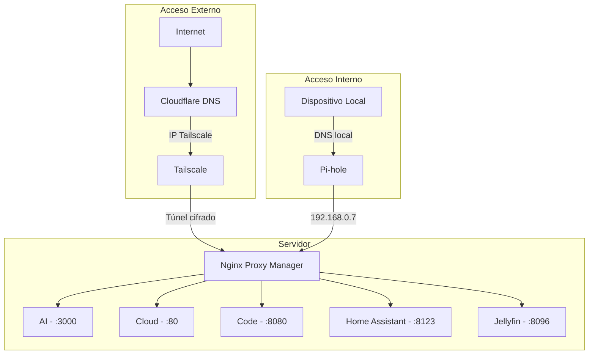
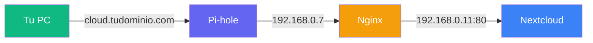

Si sigues el blog, sabes que esta historia empezó hace un tiempo. En el post sobre [cómo mi profesor de Redes tenía razón](/es/blog/my-networking-professor-was-right), conté cómo organicé mi red doméstica con Proxmox, Pi-hole y VPN. Después, en el artículo sobre [automatización de mi biblioteca de medios](/es/blog/automating-personal-media-library), mostré el ecosistema de servicios corriendo en el servidor.

Pero había algo que me molestaba: el acceso remoto. Usaba OpenVPN, funcionaba, pero era trabajoso — configurar clientes, lidiar con certificados, y siempre esa sensación de que podría ser más simple. Además, todavía tenía puertos abiertos en el router, lo que nunca me dejó 100% tranquilo.

¿Y si te dijera que puedes tener **acceso remoto seguro a todos tus servicios, con dominio propio, SSL válido y cero puertos abiertos en internet**?

En este artículo, te voy a mostrar la evolución más reciente de mi homelab — la arquitectura que finalmente me dejó satisfecho.

> **TL;DR:** Uso [Cloudflare](https://www.cloudflare.com/) como DNS público apuntando a la IP de [Tailscale](https://tailscale.com/) (cero puertos abiertos), [Nginx Proxy Manager](https://nginxproxymanager.com/) como reverse proxy con SSL, y [Pi-hole](https://pi-hole.net/) con split DNS para acceso local directo. Fuera de casa, el tráfico pasa por el túnel cifrado de Tailscale. Dentro de casa, Pi-hole resuelve directo al Nginx local.

## Qué vamos a construir

Antes de meternos en los detalles, aquí va el resumen de lo que esta arquitectura entrega:

- **Acceso interno (en casa):** tus dispositivos resuelven el dominio directo al servidor local, sin pasar por internet — rápido y directo.
- **Acceso externo (fuera de casa):** el tráfico pasa por un túnel cifrado vía Tailscale, sin ningún puerto expuesto en tu router.
- **Dominio propio con SSL:** todos los servicios accesibles por subdominios limpios como `cloud.tudominio.com`, con certificado HTTPS válido.
- **DNS inteligente:** Pi-hole resuelve localmente cuando estás en casa y Cloudflare se encarga del resto cuando estás fuera.

## Entendiendo las piezas del rompecabezas

Piensa en el setup como un edificio con portería inteligente:

| Componente | Rol | Analogía |
|---|---|---|
| **[Cloudflare](https://www.cloudflare.com/)** | DNS público | El letrero en la calle que dice "el edificio está aquí" |
| **[Tailscale](https://tailscale.com/)** | VPN mesh privada | El túnel secreto que solo los residentes conocen |
| **[Nginx Proxy Manager](https://nginxproxymanager.com/)** | Reverse proxy | El portero que sabe a qué apartamento va cada visitante |
| **[Pi-hole](https://pi-hole.net/)** | DNS local + split DNS | El interfono interno — si ya estás en el edificio, no necesitas salir para entrar |

Cada pieza tiene una responsabilidad clara. Juntas, forman una arquitectura que es segura por diseño, no por suerte.

## La arquitectura completa

Aquí está el flujo visual de cómo todo se conecta:



Observa que existen **dos caminos** para llegar a los servicios, pero ambos convergen en el Nginx Proxy Manager. Esa es la belleza del setup: un único punto de entrada, dos rutas de acceso.

## Setup paso a paso

### 1. Configurando Tailscale

[Tailscale](https://tailscale.com/) es el corazón de la seguridad de este setup. Crea una red privada (llamada **tailnet**) entre tus dispositivos usando el protocolo [WireGuard](https://www.wireguard.com/) por debajo — sin necesidad de abrir puertos.

**Instalación en el servidor:**

```bash
curl -fsSL https://tailscale.com/install.sh | sh
sudo tailscale up --advertise-routes=192.168.0.0/24
```

El parámetro `--advertise-routes` es crucial: le dice a Tailscale que tu servidor puede enrutar tráfico hacia la red `192.168.0.0/24`. Esto significa que, desde afuera, puedes acceder a cualquier dispositivo de tu red local a través de Tailscale.

**Configuraciones importantes en el panel de Tailscale:**

- **MagicDNS:** actívalo para resolver nombres de la tailnet automáticamente.
- **HTTPS Certificates:** actívalo para obtener certificados SSL válidos para los dispositivos de la tailnet.
- **Subnet routes:** aprueba la ruta `192.168.0.0/24` en el panel de administración.

Después de la configuración, tu servidor recibe una IP en el rango `100.x.y.z` — esta es la IP que usaremos en Cloudflare.

### 2. Configurando Cloudflare

En Cloudflare, la configuración es directa. Para cada servicio, crea un registro DNS de tipo **A**:

| Subdominio | Tipo | Valor | Proxy |
|---|---|---|---|
| `ai.tudominio.com` | A | `100.x.y.z` | DNS only |
| `cloud.tudominio.com` | A | `100.x.y.z` | DNS only |
| `code.tudominio.com` | A | `100.x.y.z` | DNS only |
| `ha.tudominio.com` | A | `100.x.y.z` | DNS only |
| `jellyfin.tudominio.com` | A | `100.x.y.z` | DNS only |

**¿Por qué "DNS only" y no "Proxied"?**

Porque el tráfico ya pasa por Tailscale, que es cifrado de extremo a extremo. Si activáramos el proxy de Cloudflare, intentaría conectarse a la IP de Tailscale — y no podría, porque esa IP solo es accesible desde dentro de la tailnet.

Cloudflare aquí funciona puramente como DNS autoritativo: "este dominio apunta a esta IP". Quien resuelve la conexión real es Tailscale.

### 3. Configurando Nginx Proxy Manager

[Nginx Proxy Manager](https://nginxproxymanager.com/) (NPM) es la interfaz amigable que hace el enrutamiento de los subdominios hacia los servicios correctos.

**Instalación vía Docker Compose:**

```yaml
services:
  nginx-proxy-manager:
    image: jc21/nginx-proxy-manager:latest
    container_name: nginx-proxy-manager
    restart: unless-stopped
    ports:
      - "80:80"
      - "443:443"
      - "81:81"  # Panel de administración
    volumes:
      - ./data:/data
      - ./letsencrypt:/etc/letsencrypt
```

**Configurando un Proxy Host:**

Para cada servicio, crea un **Proxy Host** en el panel de NPM:

1. **Domain Names:** `ai.tudominio.com`
2. **Scheme:** `http`
3. **Forward Hostname/IP:** `192.168.0.24`
4. **Forward Port:** `3000`
5. **SSL:** Request a new SSL certificate ([Let's Encrypt](https://letsencrypt.org/))
6. **Force SSL:** activado

Repite para cada servicio:

| Subdominio | Destino |
|---|---|
| `ai` | `192.168.0.24:3000` |
| `cloud` | `192.168.0.11:80` |
| `code` | `192.168.0.24:8080` |
| `ha` | `192.168.0.12:8123` |
| `jellyfin` | `192.168.0.13:8096` |

NPM se encarga automáticamente de la renovación de los certificados SSL. Lo configuras una vez y te olvidas.

### 4. Configurando Pi-hole (Split DNS)

Aquí está el toque final — y quizás la parte más elegante del setup.

[Pi-hole](https://pi-hole.net/) ya es conocido como bloqueador de anuncios vía DNS. Pero tiene una funcionalidad poderosa que pocas personas exploran: el **Local DNS**.

**El problema sin split DNS:**

Cuando estás en casa y accedes a `cloud.tudominio.com`, sin split DNS el flujo sería:

```
Tu PC → Internet → Cloudflare → IP Tailscale → de vuelta a tu red
```

Esto es ineficiente — el tráfico sale de tu red y vuelve. Peor: puede que ni funcione si Tailscale no está corriendo en el dispositivo local.

**La solución con split DNS:**

Agrega en Pi-hole una entrada que resuelve todo el dominio a la IP local del Nginx:

```
address=/tudominio.com/192.168.0.7
```

Esta línea mágica dice: "cualquier cosa que termine con `tudominio.com`, resuelve a `192.168.0.7`". Esto incluye todos los subdominios automáticamente.

**Cómo configurar:**

1. Accede al panel de Pi-hole
2. Ve a **Local DNS → DNS Records**
3. O edita directamente el archivo de configuración:

```bash
sudo nano /etc/dnsmasq.d/02-custom.conf
```

Agrega:

```
address=/tudominio.com/192.168.0.7
```

4. Reinicia Pi-hole:

```bash
sudo pihole restartdns
```

Ahora, cuando estás en casa, el flujo es:

```
Tu PC → Pi-hole → 192.168.0.7 (Nginx) → Servicio local
```

Directo, rápido, sin salir de la red.

## Flujo interno vs externo: cómo todo se conecta

Vamos a visualizar los dos escenarios lado a lado:

### Cuando estás en casa



1. Tu PC le pregunta a Pi-hole: "¿dónde está `cloud.tudominio.com`?"
2. Pi-hole responde: `192.168.0.7` (Nginx local)
3. Nginx recibe la solicitud y la reenvía a `192.168.0.11:80`
4. Nextcloud responde

**Latencia:** prácticamente cero. Todo sucede en la red local.

### Cuando estás fuera de casa


1. Tu celular (con Tailscale activo) resuelve `cloud.tudominio.com` vía Cloudflare
2. Cloudflare devuelve la IP Tailscale del servidor
3. Tailscale crea un túnel cifrado hasta el servidor
4. Nginx recibe y reenvía a Nextcloud
5. Todo cifrado, sin puertos abiertos

**Seguridad:** aunque alguien descubra la IP de Tailscale, no puede conectarse — necesitaría estar autenticado en tu tailnet.

## Problemas comunes y cómo resolverlos

### "No puedo acceder a los servicios desde afuera"

**Checklist:**

- ¿Tailscale está corriendo en tu dispositivo móvil/laptop?
- ¿Las subnet routes (`192.168.0.0/24`) fueron aprobadas en el panel de administración de Tailscale? Es fácil olvidarse — aprobar en el admin es un paso separado del `--advertise-routes`.
- ¿El DNS de Cloudflare apunta a la IP Tailscale correcta? Verifica con `tailscale ip -4` en el servidor.
- ¿Nginx Proxy Manager está corriendo y escuchando en el puerto 443?
- Intenta acceder directamente por la IP de Tailscale (`https://100.x.y.z`) para aislar si el problema es DNS o conectividad.

### "Funciona afuera pero no dentro de casa"

Este es el problema más común de quien configura todo y se olvida del split DNS. Lo que sucede: dentro de casa, tu dispositivo resuelve el dominio vía Cloudflare, recibe la IP de Tailscale (`100.x.y.z`), pero no puede conectarse porque Tailscale no está corriendo en ese dispositivo local. Esto se llama **hairpin NAT** — el tráfico sale de la red e intenta volver.

**Checklist:**

- ¿Tus dispositivos están usando Pi-hole como servidor DNS? Verifica en **Settings → DNS** en el router o directamente en el dispositivo. Si el DHCP entrega otro DNS, el split DNS no va a funcionar.
- ¿La entrada `address=/tudominio.com/192.168.0.7` está en dnsmasq?
- ¿Pi-hole fue reiniciado después del cambio? (`pihole restartdns`)
- Prueba con `nslookup cloud.tudominio.com` — el resultado debe ser `192.168.0.7`, no `100.x.y.z`.

### "SSL no funciona / certificado inválido"

- Los certificados [Let's Encrypt](https://letsencrypt.org/) requieren validación del dominio. Si usas **HTTP challenge**, Nginx necesita ser accesible desde internet en el puerto 80 — lo que entra en conflicto con nuestro setup de cero puertos abiertos.
- **Solución recomendada:** usa **DNS challenge** con la API de Cloudflare. En NPM, ve a SSL Certificates → Add → selecciona "Use a DNS Challenge" y configura las credenciales de la API de Cloudflare. Así la validación ocurre vía DNS, sin necesidad de puertos abiertos.
- Si el certificado funciona afuera pero no dentro de casa, el problema probablemente es el split DNS — el navegador está intentando validar el certificado contra la IP local.

### "Tailscale se desconecta después de un rato"

- En el servidor, usa `sudo tailscale up --operator=$USER` para evitar que la sesión expire.
- En dispositivos móviles, asegúrate de que la app tenga permiso para correr en segundo plano.
- En Android, desactiva la "optimización de batería" para la app de Tailscale.
- En iOS, activa "Background App Refresh" en los ajustes de Tailscale.

### "El DNS tarda en actualizarse"

- Limpia el caché DNS local: `sudo resolvectl flush-caches` (Linux) o `ipconfig /flushdns` (Windows).
- En Pi-hole, ve a **Settings → DNS** y reduce el TTL si es necesario.
- Los navegadores también hacen caché de DNS internamente — intenta en una pestaña de incógnito o reinicia el navegador.

## Por qué esta arquitectura es superior

Comparando con enfoques tradicionales:

| Aspecto | Port Forwarding Tradicional | Este Setup |
|---|---|---|
| **Puertos abiertos** | Sí (80, 443, etc.) | Ninguno |
| **IP pública expuesta** | Sí | No |
| **Necesita DDNS** | Sí | No |
| **Cifrado** | Depende de la config | Siempre (WireGuard) |
| **Acceso interno** | Puede tener hairpin NAT | Directo vía split DNS |
| **Complejidad** | Media (pero frágil) | Media (pero robusta) |
| **Escalabilidad** | Limitada | Excelente |

Otros beneficios:

- **Seguridad zero-trust:** cada dispositivo necesita estar autenticado en la tailnet.
- **Sin single point of failure en internet:** si Cloudflare se cae, el acceso interno sigue funcionando normalmente.
- **Fácil de escalar:** ¿nuevo servicio? Agrega un proxy host en Nginx y un registro en Cloudflare. Listo.
- **Privacidad:** Pi-hole sigue bloqueando anuncios y trackers para toda la red.

## La evolución del setup

Si sigues el blog, viste este camino desarrollarse en tiempo real:

1. **[Mi profesor de Redes tenía razón](/es/blog/my-networking-professor-was-right):** donde todo empezó — organicé la red, segmenté por función, puse Pi-hole y Proxmox a funcionar. El acceso remoto era vía OpenVPN.
2. **[Automatizando mi biblioteca de medios](/es/blog/automating-personal-media-library):** el homelab tomó forma con Jellyfin, Sonarr, Radarr y todo el ecosistema de servicios self-hosted.
3. **Descubrimiento de Tailscale:** el punto de inflexión. Acceso remoto sin abrir puertos cambió todo. Retiré OpenVPN el mismo día.
4. **Nginx Proxy Manager:** subdominios organizados con SSL, finalmente un setup presentable.
5. **Split DNS con Pi-hole:** el toque final para eliminar la latencia innecesaria en el acceso local.

Cada etapa fue un aprendizaje. El setup que muestro aquí no nació listo — es el resultado de muchas iteraciones. Y probablemente seguirá evolucionando.

## Conclusión

Montar un homelab seguro no tiene que ser complicado ni costoso. Con cuatro herramientas — Cloudflare, Tailscale, Nginx Proxy Manager y Pi-hole — puedes:

- Acceder a tus servicios desde cualquier lugar del mundo
- Sin abrir un solo puerto en tu router
- Con cifrado de extremo a extremo
- Con dominio propio y SSL válido
- Con acceso local rápido e inteligente

Lo más importante: tienes **control total** sobre tus datos y tu infraestructura. Ningún servicio de terceros tiene acceso al contenido de tus servicios — Tailscale y Cloudflare solo enrutan el tráfico.

Si estás empezando tu homelab o quieres mejorar el acceso remoto, este es un excelente punto de partida. Y si ya tienes algo corriendo, adaptarlo a esta arquitectura es más simple de lo que parece.

---

## Una nota personal

Necesito ser honesto: redes e infraestructura **no es mi área principal**. Soy desarrollador de software — mi día a día es código, no enrutamiento de paquetes. Todo lo que mostré aquí es fruto de curiosidad, noches investigando y mucha prueba y error.

Empecé a interesarme por networking hace relativamente poco tiempo, y cada problema resuelto me jala más profundo en esta madriguera. Pero justamente por no ser mi especialidad, sé que siempre hay espacio para mejorar.

Si trabajas en redes, infraestructura o seguridad y viste algo que se puede hacer mejor — **las contribuciones son muy bienvenidas**. Escríbeme o manda una sugerencia. Este blog es un espacio de aprendizaje, y aprendo tanto escribiendo como recibiendo feedback de ustedes.
