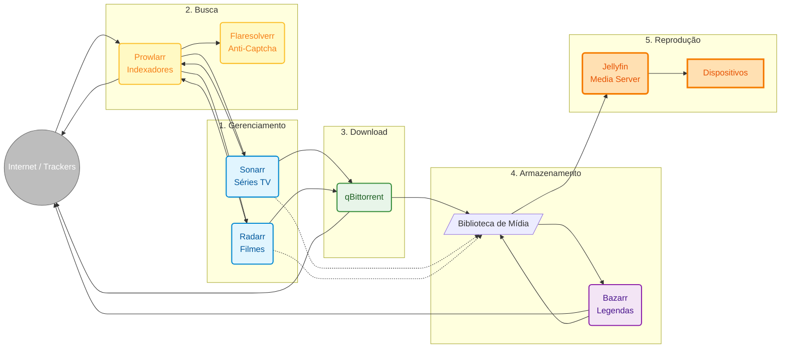

No [post anterior sobre meu servidor caseiro](/pt/blog/2025-12-22-my-networking-professor-was-right), mostrei como organizei minha rede doméstica com Proxmox, Pi-hole e outros serviços. Uma das peças centrais era o **[Jellyfin](https://jellyfin.org/)** — um servidor de mídia open-source para organizar e reproduzir minha coleção pessoal.

Mas havia um problema: **gerenciar manualmente** uma biblioteca de mídia é trabalhoso demais. Baixar arquivos, converter formatos, renomear, organizar em pastas, buscar legendas... tudo manual.

Decidi ir além e criar um **sistema completamente automatizado** de gerenciamento de mídia pessoal. E o resultado? Um fluxo que organiza automaticamente minha biblioteca de vídeos e conteúdo.

---

## O Problema: Gerenciamento Manual é Insustentável

Antes da automação, meu processo de organizar minha biblioteca de mídia era assim:

1. Buscar e baixar arquivos de mídia
2. Converter para formatos compatíveis quando necessário
3. Renomear arquivos manualmente para um padrão consistente
4. Mover para a pasta correta do Jellyfin
5. Buscar legendas em português
6. Atualizar a biblioteca do Jellyfin manualmente

Isso funcionava para uma coleção pequena... mas quando você tem dezenas de arquivos para organizar regularmente, o processo manual se torna insustentável.

**Precisava de automação.**

---

## A Solução: Um Ecossistema de Ferramentas Integradas

Depois de muita pesquisa, cheguei nessa arquitetura:



Parece complexo? Vou explicar cada peça.

---

## As Ferramentas e Suas Funções

### 1. **Sonarr e Radarr** — Os Gerenciadores

**[Sonarr](https://sonarr.tv/)** gerencia séries de TV. **[Radarr](https://radarr.video/)** gerencia filmes.

Eles são o "cérebro" do sistema de organização. Essas ferramentas foram originalmente criadas para gerenciar coleções de mídia Usenet, mas funcionam perfeitamente para organizar qualquer biblioteca de vídeos:

- Monitoram sua biblioteca e identificam arquivos desorganizados
- Renomeiam automaticamente seguindo padrões consistentes
- Organizam em estrutura de pastas lógica
- Atualizam metadados e artwork
- Integram com o Jellyfin para manter tudo sincronizado

**Exemplo prático:** Tenho uma pasta com episódios da série "Breaking Bad" com nomes inconsistentes. O Sonarr:
- Identifica automaticamente cada episódio
- Renomeia para padrão consistente: `Breaking Bad - S01E01 - Pilot.mkv`
- Organiza em `/media/Series/Breaking Bad/Season 01/`
- Atualiza metadados no Jellyfin

Tudo isso **automaticamente**.

---

### 2. **Prowlarr** — O Gerenciador de Fontes

**[Prowlarr](https://prowlarr.com/)** centraliza o gerenciamento de fontes de metadados e indexadores.

Em vez de configurar cada fonte de dados no Sonarr e no Radarr separadamente, você configura tudo no Prowlarr uma vez, e ele sincroniza automaticamente com todos os serviços.

**Por que isso importa?**
- Adicionar uma nova fonte de metadados? Configure no Prowlarr e todos os serviços recebem
- Remover uma fonte problemática? Um clique
- Testar qual fonte tem melhores resultados? Dashboard centralizado

Isso é especialmente útil quando você usa múltiplas fontes legítimas como bases de dados públicas de metadados de filmes e séries.

---

### 3. **Flaresolverr** — O Resolvedor de Proteções

**[Flaresolverr](https://github.com/FlareSolverr/FlareSolverr)** é um proxy que lida com proteções anti-bot (Cloudflare, captchas) que alguns sites de metadados usam.

Sem ele, muitas consultas a bases de dados públicas falhariam. Com ele, tudo funciona transparentemente, permitindo que os serviços busquem informações sobre filmes e séries automaticamente.

---

### 4. **qBittorrent** — O Gerenciador de Transferências

**[qBittorrent](https://www.qbittorrent.org/)** é um cliente BitTorrent open-source que uso para transferir arquivos grandes de forma eficiente.

É perfeito para distribuir conteúdo próprio (como vídeos de projetos pessoais) ou baixar distribuições Linux e conteúdo de domínio público. Ele roda em modo headless (sem interface gráfica) e é controlado via API.

**Configurações importantes:**
- Gerenciamento automático de transferências
- Mover arquivos concluídos para pasta de processamento
- Limites de velocidade para não congestionar a rede
- Controle de upload/download configurável

---

### 5. **Bazarr** — O Gerenciador de Legendas

**[Bazarr](https://www.bazarr.media/)** monitora a biblioteca de mídia e busca legendas automaticamente em repositórios públicos como OpenSubtitles, Subdivx, e outros.

**Como funciona:**
1. Um novo arquivo de vídeo é adicionado à biblioteca
2. Bazarr detecta o novo arquivo
3. Busca legendas em português (PT-BR) em bases públicas
4. Baixa e salva junto ao arquivo de vídeo
5. Jellyfin detecta e disponibiliza a legenda

Isso é especialmente útil para vídeos caseiros, documentários educacionais, ou conteúdo que não vem com legendas em português.

---

### 6. **Jellyfin** — O Media Server

**[Jellyfin](https://jellyfin.org/)** é o servidor de mídia open-source que organiza e reproduz todo o conteúdo. Ele:

- Escaneia a biblioteca de mídia
- Busca metadados (sinopse, pôsteres, elenco) em bases públicas como TMDB/TVDB
- Transcodifica vídeos em tempo real (se necessário)
- Disponibiliza apps para TV, celular, navegador

É uma solução completa para organizar sua coleção pessoal de vídeos, com **controle total** sobre seus dados e privacidade.

---

## O Fluxo Completo em Ação

Vamos ver um exemplo real de como tudo funciona junto:

**Cenário:** Baixei uma série completa e quero organizá-la automaticamente

1. **Adiciono a série no Sonarr** → Defino padrão de nomenclatura e organização
2. **Coloco os arquivos na pasta de importação** → Arquivos com nomes inconsistentes
3. **Sonarr detecta os arquivos** → Identifica automaticamente cada episódio
4. **Sonarr organiza e renomeia** → Move para `/media/Series/Nome da Serie/Season 01/` com nome padronizado
5. **Bazarr detecta novos arquivos** → Busca legendas PT-BR em repositórios públicos
6. **Bazarr baixa legendas** → Salva como `.srt` junto aos arquivos de vídeo
7. **Jellyfin escaneia** → Detecta novos episódios, busca metadados no TMDB, disponibiliza

**Tudo isso acontece automaticamente.** Eu só coloco os arquivos na pasta de importação e o sistema cuida do resto.

---

## Infraestrutura: Proxmox + Docker Compose

Como mencionei no [post anterior](/pt/blog/2025-12-22-my-networking-professor-was-right), tudo roda no meu servidor caseiro com **Proxmox VE**. Criei um container LXC dedicado para esse stack de mídia, o que garante isolamento e facilita gerenciamento.

Dentro desse container, todos os serviços rodam via **Docker Compose**, o que garante:

- **Isolamento** — Cada serviço roda independente
- **Portabilidade** — Posso mover tudo para outro servidor/container facilmente
- **Atualizações simples** — `docker-compose pull && docker-compose up -d`
- **Backup facilitado** — Volumes mapeados para fácil backup
- **Recursos controlados** — Proxmox permite limitar CPU/RAM do container

**Estrutura de pastas:**

```
/media/
├── Series/          # Séries organizadas
├── Movies/          # Filmes organizados
└── Downloads/       # Pasta temporária de downloads

/docker/
├── sonarr/
├── radarr/
├── prowlarr/
├── bazarr/
├── qbittorrent/
├── flaresolverr/
└── jellyfin/
```

---

## Configurações de Rede

Cada serviço tem um IP fixo na minha rede (lembra do [post sobre organização de rede](/pt/blog/2025-12-22-my-networking-professor-was-right)?):

| Serviço | IP | Porta |
|---------|-----|-------|
| Jellyfin | 192.168.1.13 | 8096 |
| Bazarr | 192.168.1.16 | 6767 |
| qBittorrent | 192.168.1.17 | 8080 |
| Sonarr | 192.168.1.18 | 8989 |
| Prowlarr | 192.168.1.19 | 9696 |
| Flaresolverr | 192.168.1.8 | 8191 |
| Radarr | 192.168.1.9 | 7878 |

Isso facilita debug, firewall rules, e acesso via VPN.

---

## Benefícios Reais

Depois de meses usando esse sistema:

### ✅ **Automação Total**
- Arquivos organizados automaticamente
- Legendas adicionadas automaticamente
- Biblioteca sempre organizada e consistente

### ✅ **Qualidade Consistente**
- Nomenclatura padronizada
- Estrutura de pastas lógica
- Metadados completos (sinopse, pôsteres, elenco)

### ✅ **Controle Total**
- Seus dados permanecem com você
- Sem dependência de serviços terceiros
- Acesso offline completo
- Privacidade garantida

### ✅ **Economia**
- Software 100% open-source e gratuito
- Hardware usado/barato funciona perfeitamente
- Sem custos recorrentes

---

## Considerações Importantes

### **Legalidade e Uso Responsável**

Este sistema é uma ferramenta de **gerenciamento e organização de biblioteca pessoal de mídia**. Todas as ferramentas mencionadas são software open-source legítimo, usado por milhares de pessoas para organizar conteúdo legal.

**Casos de uso legítimos incluem:**

- **Conteúdo próprio**: Organizar vídeos caseiros, gravações de família, projetos pessoais
- **Conteúdo de domínio público**: Filmes clássicos, documentários educacionais, conteúdo sem copyright
- **Produções licenciadas**: Conteúdo que você criou ou tem licença para usar
- **Distribuições Linux**: Organizar ISOs e conteúdo open-source
- **Mídia pessoal**: Organizar qualquer conteúdo digital que você possua legalmente

**É sua responsabilidade garantir que você possui os direitos legais sobre todo o conteúdo que gerencia.** Respeite as leis de direitos autorais do seu país.

Essas ferramentas são neutras — como um HD externo ou um pen drive. O que importa é como você as usa.

### **Segurança**

- **Nunca exponha esses serviços diretamente na internet**
- Use VPN para acesso remoto (OpenVPN, WireGuard)
- Configure autenticação forte em todos os serviços
- Mantenha tudo atualizado

### **Performance**

- SSD para o sistema operacional e containers
- HDD para armazenamento de mídia (mais barato por TB)
- Mínimo 8GB RAM (16GB recomendado)
- CPU com suporte a transcodificação de vídeo (Intel QuickSync ou GPU dedicada)

---

## O Que Aprendi

1. **Automação bem feita é invisível** — Quando funciona, você esquece que existe
2. **Open-source é poderoso** — Todas essas ferramentas são gratuitas e mantidas por comunidades incríveis
3. **Documentação salva vidas** — Manter um diagrama e notas sobre configurações é essencial
4. **Backup é obrigatório** — Perder configurações de meses por falta de backup é doloroso
5. **A comunidade é fundamental** — Fóruns, Reddit, Discord... sempre tem alguém que já passou pelo mesmo problema

---


## Conclusão

Construir um sistema de gerenciamento de mídia pessoal automatizado pode parecer complexo no início, mas o resultado é **libertador**.

Você tem controle total sobre seus dados e privacidade, organização profissional da sua coleção pessoal, e acesso a todo o seu conteúdo de qualquer lugar (via VPN).

E o melhor: uma vez configurado, **funciona sozinho**. Basta adicionar novos arquivos e o sistema cuida de organizar, renomear, adicionar metadados e legendas automaticamente.

---

*Tem algum servidor de mídia ou projeto de automação? Quer trocar ideias sobre homelab? Me chama!*
