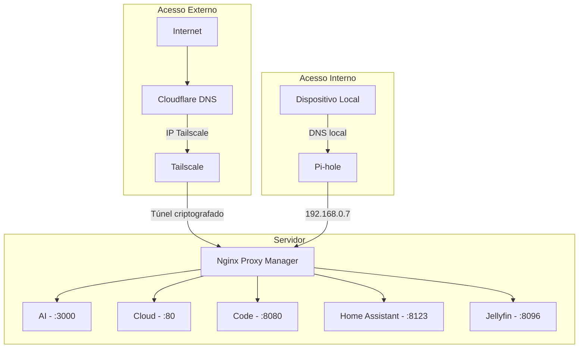

Se você acompanha o blog, sabe que essa história começou lá atrás. No post sobre [como meu professor de Redes tinha razão](/pt/blog/my-networking-professor-was-right), contei como organizei minha rede doméstica com Proxmox, Pi-hole e VPN. Depois, no artigo sobre [automação da minha biblioteca de mídia](/pt/blog/automating-personal-media-library), mostrei o ecossistema de serviços rodando no servidor.

Mas tinha um problema que me incomodava: o acesso remoto. Eu usava OpenVPN, funcionava, mas era trabalhoso — configurar clientes, lidar com certificados, e sempre aquela sensação de que poderia ser mais simples. Além disso, ainda tinha portas abertas no roteador, o que nunca me deixou 100% tranquilo.

E se eu te dissesse que dá pra ter **acesso remoto seguro a todos os seus serviços, com domínio próprio, SSL válido e zero portas abertas na internet**?

Neste artigo, vou te mostrar a evolução mais recente do meu homelab — a arquitetura que finalmente me deixou satisfeito.

> **TL;DR:** Uso [Cloudflare](https://www.cloudflare.com/) como DNS público apontando para o IP do [Tailscale](https://tailscale.com/) (zero portas abertas), [Nginx Proxy Manager](https://nginxproxymanager.com/) como reverse proxy com SSL, e [Pi-hole](https://pi-hole.net/) com split DNS para acesso local direto. Fora de casa, o tráfego passa pelo túnel criptografado do Tailscale. Dentro de casa, o Pi-hole resolve direto pro Nginx local.

## O que vamos construir

Antes de mergulhar nos detalhes, aqui vai o resumo do que essa arquitetura entrega:

- **Acesso interno (em casa):** seus dispositivos resolvem o domínio direto para o servidor local, sem passar pela internet — rápido e direto.
- **Acesso externo (fora de casa):** o tráfego passa por um túnel criptografado via Tailscale, sem nenhuma porta exposta no seu roteador.

- **Domínio próprio com SSL:** todos os serviços acessíveis por subdomínios bonitos como `cloud.seudominio.com`, com certificado HTTPS válido.
- **DNS inteligente:** o Pi-hole resolve localmente quando você está em casa e o Cloudflare cuida do resto quando você está fora.

## Entendendo as peças do quebra-cabeça

Pense no setup como um prédio com portaria inteligente:

| Componente | Papel | Analogia |
|---|---|---|
| **[Cloudflare](https://www.cloudflare.com/)** | DNS público | A placa na rua que diz "o prédio fica aqui" |
| **[Tailscale](https://tailscale.com/)** | VPN mesh privada | O túnel secreto que só moradores conhecem |
| **[Nginx Proxy Manager](https://nginxproxymanager.com/)** | Reverse proxy | O porteiro que sabe em qual apartamento cada visitante quer ir |
| **[Pi-hole](https://pi-hole.net/)** | DNS local + split DNS | O interfone interno — se você já está no prédio, não precisa sair pra entrar |

Cada peça tem uma responsabilidade clara. Juntas, elas formam uma arquitetura que é segura por design, não por sorte.

## A arquitetura completa

Aqui está o fluxo visual de como tudo se conecta:



Perceba que existem **dois caminhos** para chegar aos serviços, mas ambos convergem no Nginx Proxy Manager. Essa é a beleza do setup: um único ponto de entrada, duas rotas de acesso.

## Setup passo a passo

### 1. Configurando o Tailscale

O [Tailscale](https://tailscale.com/) é o coração da segurança desse setup. Ele cria uma rede privada (chamada **tailnet**) entre seus dispositivos usando o protocolo [WireGuard](https://www.wireguard.com/) por baixo dos panos — sem precisar abrir portas.

**Instalação no servidor:**

```bash
curl -fsSL https://tailscale.com/install.sh | sh
sudo tailscale up --advertise-routes=192.168.0.0/24
```

O parâmetro `--advertise-routes` é crucial: ele diz ao Tailscale que seu servidor pode rotear tráfego para a rede `192.168.0.0/24`. Isso significa que, de fora, você consegue acessar qualquer dispositivo da sua rede local através do Tailscale.

**Configurações importantes no painel do Tailscale:**

- **MagicDNS:** ative para resolver nomes da tailnet automaticamente.
- **HTTPS Certificates:** ative para obter certificados SSL válidos para os dispositivos da tailnet.
- **Subnet routes:** aprove a rota `192.168.0.0/24` no painel de administração.

Após a configuração, seu servidor recebe um IP na faixa `100.x.y.z` — esse é o IP que usaremos no Cloudflare.

### 2. Configurando o Cloudflare

No Cloudflare, a configuração é direta. Para cada serviço, crie um registro DNS do tipo **A**:

| Subdomínio | Tipo | Valor | Proxy |
|---|---|---|---|
| `ai.seudominio.com` | A | `100.x.y.z` | DNS only |
| `cloud.seudominio.com` | A | `100.x.y.z` | DNS only |
| `code.seudominio.com` | A | `100.x.y.z` | DNS only |
| `ha.seudominio.com` | A | `100.x.y.z` | DNS only |
| `jellyfin.seudominio.com` | A | `100.x.y.z` | DNS only |

**Por que "DNS only" e não "Proxied"?**

Porque o tráfego já passa pelo Tailscale, que é criptografado de ponta a ponta. Se ativássemos o proxy do Cloudflare, ele tentaria se conectar ao IP Tailscale — e não conseguiria, porque esse IP só é acessível de dentro da tailnet.

O Cloudflare aqui funciona puramente como DNS autoritativo: "esse domínio aponta para esse IP". Quem resolve a conexão real é o Tailscale.

### 3. Configurando o Nginx Proxy Manager

O [Nginx Proxy Manager](https://nginxproxymanager.com/) (NPM) é a interface amigável que faz o roteamento dos subdomínios para os serviços corretos.

**Instalação via Docker Compose:**

```yaml
services:
  nginx-proxy-manager:
    image: jc21/nginx-proxy-manager:latest
    container_name: nginx-proxy-manager
    restart: unless-stopped
    ports:
      - "80:80"
      - "443:443"
      - "81:81"  # Painel de administração
    volumes:
      - ./data:/data
      - ./letsencrypt:/etc/letsencrypt
```

**Configurando um Proxy Host:**

Para cada serviço, crie um **Proxy Host** no painel do NPM:

1. **Domain Names:** `ai.seudominio.com`
2. **Scheme:** `http`
3. **Forward Hostname/IP:** `192.168.0.24`
4. **Forward Port:** `3000`
5. **SSL:** Request a new SSL certificate ([Let's Encrypt](https://letsencrypt.org/))
6. **Force SSL:** ativado

Repita para cada serviço:

| Subdomínio | Destino |
|---|---|
| `ai` | `192.168.0.24:3000` |
| `cloud` | `192.168.0.11:80` |
| `code` | `192.168.0.24:8080` |
| `ha` | `192.168.0.12:8123` |
| `jellyfin` | `192.168.0.13:8096` |

O NPM cuida automaticamente da renovação dos certificados SSL. Você configura uma vez e esquece.

### 4. Configurando o Pi-hole (Split DNS)

Aqui está o toque final — e talvez a parte mais elegante do setup.

O [Pi-hole](https://pi-hole.net/) já é conhecido como bloqueador de anúncios via DNS. Mas ele tem um recurso poderoso que poucas pessoas exploram: o **Local DNS**.

**O problema sem split DNS:**

Quando você está em casa e acessa `cloud.seudominio.com`, sem split DNS o fluxo seria:

```
Seu PC → Internet → Cloudflare → IP Tailscale → volta pra sua rede
```

Isso é ineficiente — o tráfego sai da sua rede e volta. Pior: pode nem funcionar se o Tailscale não estiver rodando no dispositivo local.

**A solução com split DNS:**

Adicione no Pi-hole uma entrada que resolve todo o domínio para o IP local do Nginx:

```
address=/seudominio.com/192.168.0.7
```

Essa linha mágica diz: "qualquer coisa que termine com `seudominio.com`, resolve para `192.168.0.7`". Isso inclui todos os subdomínios automaticamente.

**Como configurar:**

1. Acesse o painel do Pi-hole
2. Vá em **Local DNS → DNS Records**
3. Ou edite diretamente o arquivo de configuração:

```bash
sudo nano /etc/dnsmasq.d/02-custom.conf
```

Adicione:

```
address=/seudominio.com/192.168.0.7
```

4. Reinicie o Pi-hole:

```bash
sudo pihole restartdns
```

Agora, quando você está em casa, o fluxo é:

```
Seu PC → Pi-hole → 192.168.0.7 (Nginx) → Serviço local
```

Direto, rápido, sem sair da rede.

## Fluxo interno vs externo: como tudo se conecta

Vamos visualizar os dois cenários lado a lado:

### Quando você está em casa


1. Seu PC pergunta ao Pi-hole: "onde fica `cloud.seudominio.com`?"
2. Pi-hole responde: `192.168.0.7` (Nginx local)
3. Nginx recebe a requisição e encaminha para `192.168.0.11:80`
4. Nextcloud responde

**Latência:** praticamente zero. Tudo acontece na rede local.

### Quando você está fora de casa


1. Seu celular (com Tailscale ativo) resolve `cloud.seudominio.com` via Cloudflare
2. Cloudflare retorna o IP Tailscale do servidor
3. O Tailscale cria um túnel criptografado até o servidor
4. Nginx recebe e encaminha para o Nextcloud
5. Tudo criptografado, sem portas abertas

**Segurança:** mesmo que alguém descubra o IP Tailscale, não consegue se conectar — precisaria estar autenticado na sua tailnet.

## Problemas comuns e como resolver

### "Não consigo acessar os serviços de fora"

**Checklist:**

- O Tailscale está rodando no seu dispositivo móvel/laptop?
- As subnet routes (`192.168.0.0/24`) foram aprovadas no painel do Tailscale? Isso é fácil de esquecer — aprovar no admin é um passo separado do `--advertise-routes`.
- O DNS do Cloudflare aponta para o IP Tailscale correto? Verifique com `tailscale ip -4` no servidor.
- O Nginx Proxy Manager está rodando e escutando na porta 443?
- Tente acessar diretamente pelo IP Tailscale (`https://100.x.y.z`) pra isolar se o problema é DNS ou conectividade.

### "Funciona fora mas não funciona dentro de casa"

Esse é o problema mais comum de quem configura tudo e esquece do split DNS. O que acontece: dentro de casa, seu dispositivo resolve o domínio via Cloudflare, recebe o IP Tailscale (`100.x.y.z`), mas não consegue se conectar porque o Tailscale não está rodando naquele dispositivo local. Isso se chama **hairpin NAT** — o tráfego sai da rede e tenta voltar.

**Checklist:**

- Seus dispositivos estão usando o Pi-hole como servidor DNS? Verifique em **Settings → DNS** no roteador ou diretamente no dispositivo. Se o DHCP entrega outro DNS, o split DNS não vai funcionar.
- A entrada `address=/seudominio.com/192.168.0.7` está no dnsmasq?
- O Pi-hole foi reiniciado após a mudança? (`pihole restartdns`)
- Teste com `nslookup cloud.seudominio.com` — o resultado deve ser `192.168.0.7`, não `100.x.y.z`.

### "SSL não funciona / certificado inválido"

- Os certificados [Let's Encrypt](https://letsencrypt.org/) exigem validação do domínio. Se você usa **HTTP challenge**, o Nginx precisa ser acessível pela internet na porta 80 — o que conflita com nosso setup de zero portas abertas.
- **Solução recomendada:** use **DNS challenge** com a API do Cloudflare. No NPM, vá em SSL Certificates → Add → selecione "Use a DNS Challenge" e configure as credenciais da API do Cloudflare. Assim a validação acontece via DNS, sem precisar de portas abertas.
- Se o certificado funciona fora mas não dentro de casa, o problema provavelmente é o split DNS — o navegador está tentando validar o certificado contra o IP local.

### "O Tailscale desconecta depois de um tempo"

- No servidor, use `sudo tailscale up --operator=$USER` para evitar que a sessão expire.
- Em dispositivos móveis, certifique-se de que o app tem permissão para rodar em segundo plano.
- No Android, desative a "otimização de bateria" para o app do Tailscale.
- No iOS, ative "Background App Refresh" nas configurações do Tailscale.

### "DNS demora para atualizar"

- Limpe o cache DNS local: `sudo resolvectl flush-caches` (Linux) ou `ipconfig /flushdns` (Windows).
- No Pi-hole, vá em **Settings → DNS** e reduza o TTL se necessário.
- Navegadores também fazem cache de DNS internamente — tente em uma aba anônima ou reinicie o navegador.

## Por que essa arquitetura é superior

Comparando com abordagens tradicionais:

| Aspecto | Port Forwarding Tradicional | Este Setup |
|---|---|---|
| **Portas abertas** | Sim (80, 443, etc.) | Nenhuma |
| **IP público exposto** | Sim | Não |
| **Precisa de DDNS** | Sim | Não |
| **Criptografia** | Depende da config | Sempre (WireGuard) |
| **Acesso interno** | Pode ter hairpin NAT | Direto via split DNS |
| **Complexidade** | Média (mas frágil) | Média (mas robusta) |
| **Escalabilidade** | Limitada | Excelente |

Outros benefícios:

- **Segurança zero-trust:** cada dispositivo precisa ser autenticado na tailnet.
- **Sem single point of failure na internet:** se o Cloudflare cair, o acesso interno continua funcionando normalmente.
- **Fácil de escalar:** novo serviço? Adicione um proxy host no Nginx e um registro no Cloudflare. Pronto.
- **Privacidade:** o Pi-hole ainda bloqueia anúncios e trackers para toda a rede.

## A evolução do setup

Quem acompanha o blog viu essa jornada acontecer em tempo real:

1. **[Meu professor de Redes tinha razão](/pt/blog/my-networking-professor-was-right):** o começo de tudo — organizei a rede, segmentei por função, coloquei Pi-hole e Proxmox pra rodar. O acesso remoto era via OpenVPN.
2. **[Automatizando a biblioteca de mídia](/pt/blog/automating-personal-media-library):** o homelab ganhou corpo com Jellyfin, Sonarr, Radarr e todo o ecossistema de serviços self-hosted.
3. **Descoberta do Tailscale:** a virada de chave. Acesso remoto sem abrir portas mudou tudo. Aposentei o OpenVPN no mesmo dia.
4. **Nginx Proxy Manager:** subdomínios organizados com SSL, finalmente um setup apresentável.
5. **Split DNS com Pi-hole:** o toque final para eliminar a latência desnecessária no acesso local.

Cada etapa foi um aprendizado. O setup que mostro aqui não nasceu pronto — é o resultado de muita iteração. E provavelmente vai continuar evoluindo.

## Conclusão

Montar um homelab seguro não precisa ser complicado nem caro. Com quatro ferramentas — Cloudflare, Tailscale, Nginx Proxy Manager e Pi-hole — você consegue:

- Acessar seus serviços de qualquer lugar do mundo
- Sem abrir uma única porta no roteador
- Com criptografia de ponta a ponta
- Com domínio próprio e SSL válido
- Com acesso local rápido e inteligente

O mais importante: você tem **controle total** sobre seus dados e sua infraestrutura. Nenhum serviço de terceiro tem acesso ao conteúdo dos seus serviços — o Tailscale e o Cloudflare apenas roteiam o tráfego.

Se você está começando seu homelab ou quer melhorar o acesso remoto, esse é um excelente ponto de partida. E se já tem algo rodando, adaptar para essa arquitetura é mais simples do que parece.

---

## Uma nota pessoal

Preciso ser honesto: redes e infraestrutura **não é minha área principal**. Sou desenvolvedor de software — meu dia a dia é código, não roteamento de pacotes. Tudo isso que mostrei aqui é fruto de curiosidade, noites pesquisando e muita tentativa e erro.

Comecei a me interessar por networking há relativamente pouco tempo, e cada problema resolvido me puxa mais fundo nesse buraco. Mas justamente por não ser minha especialidade, sei que sempre tem espaço pra melhorar.

Se você é da área de redes, infra ou segurança e viu algo que pode ser feito de um jeito melhor — **contribuições são muito bem-vindas**. Pode me chamar ou mandar uma sugestão. Esse blog é um espaço de aprendizado, e eu aprendo tanto escrevendo quanto recebendo feedback de vocês.
